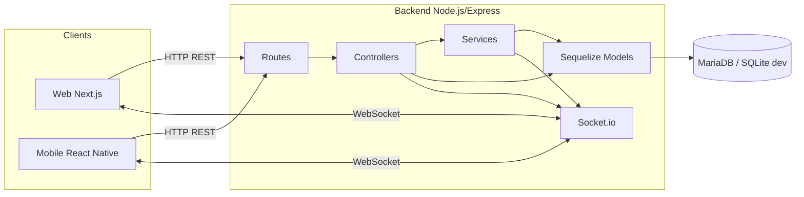
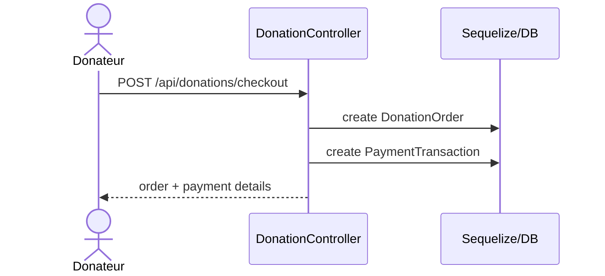
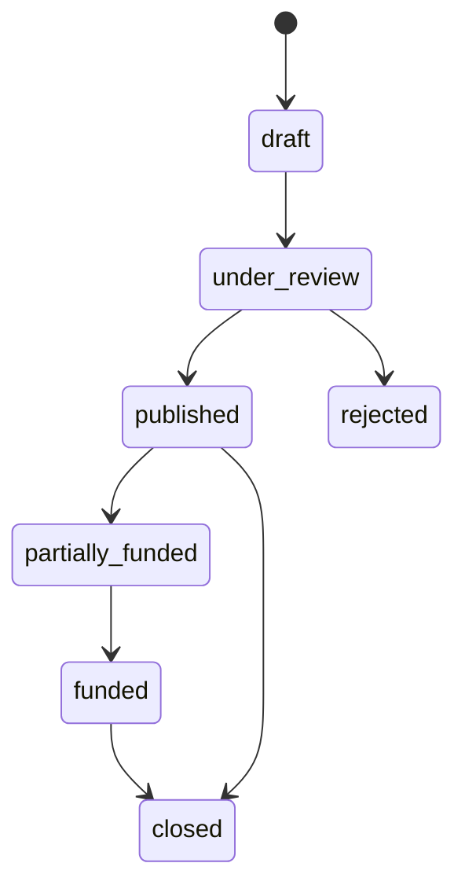

# UML Amena

Ce document regroupe une vue UML simplifiee du projet Amena.

## 1. Diagramme de composants



## 2. Diagramme de classes principal

```mermaid
classDiagram
  class User {
    +id: bigint
    +full_name: string
    +email: string
    +role: enum
    +is_active: boolean
  }

  class Organization {
    +id: bigint
    +user_id: bigint
  }

  class Beneficiary {
    +id: bigint
    +user_id: bigint
  }

  class Need {
    +id: bigint
    +organization_id: bigint?
    +beneficiary_id: bigint?
    +created_by_user_id: bigint
    +title: string
    +status: enum
  }

  class DonationOrder {
    +id: bigint
    +donor_user_id: bigint
    +total_amount: decimal
    +status: enum
  }

  class Donation {
    +id: bigint
    +order_id: bigint
    +need_id: bigint
    +amount: decimal
  }

  class PaymentTransaction {
    +id: bigint
    +donation_order_id: bigint
    +provider_name: string
    +status: enum
    +amount: decimal
  }

  User "1" --> "0..1" Organization : organization
  User "1" --> "0..1" Beneficiary : beneficiary
  Organization "1" --> "0..*" Need : publishes
  Beneficiary "1" --> "0..*" Need : concerns
  User "1" --> "0..*" DonationOrder : creates
  DonationOrder "1" --> "0..*" Donation : contains
  Need "1" --> "0..*" Donation : receives
  DonationOrder "1" --> "0..1" PaymentTransaction : paid_by
```

## 3. Diagramme de sequence



## 4. Diagramme d'etats



## 5. Fichiers UML associes

- [diagramme-classes-amena.mmd](diagramme-classes-amena.mmd)
- [diagramme-cas-utilisation-amena.mmd](diagramme-cas-utilisation-amena.mmd)
- [diagramme-activite-amena.mmd](diagramme-activite-amena.mmd)
- [diagramme-sequence-amena.mmd](diagramme-sequence-amena.mmd)
- [uml-projet-amena.md](uml-projet-amena.md)
