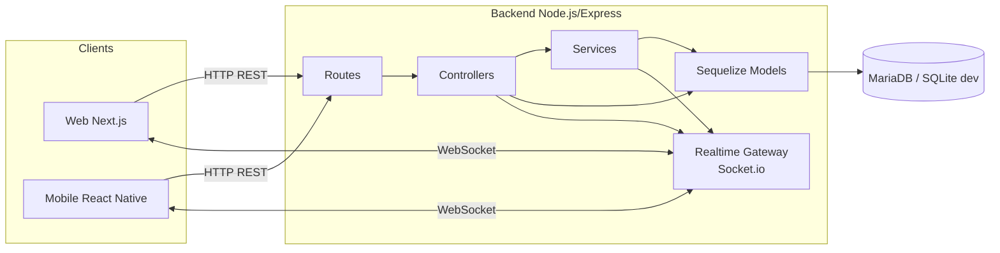
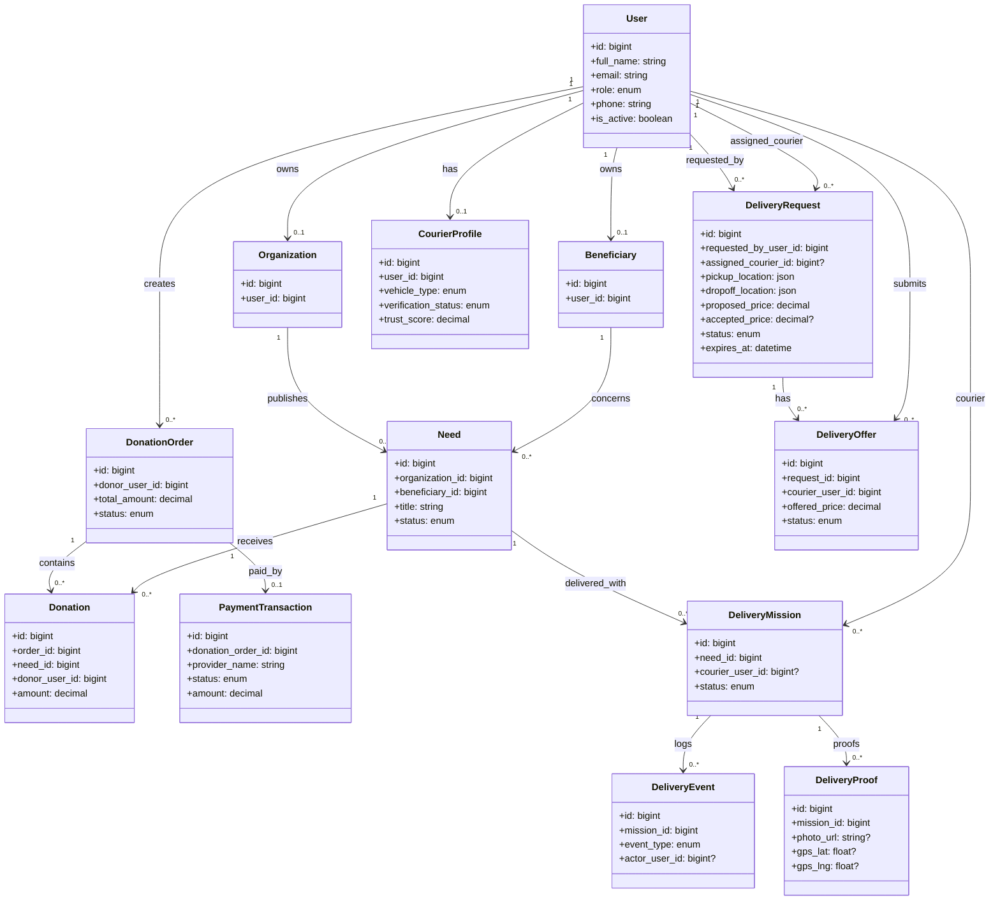
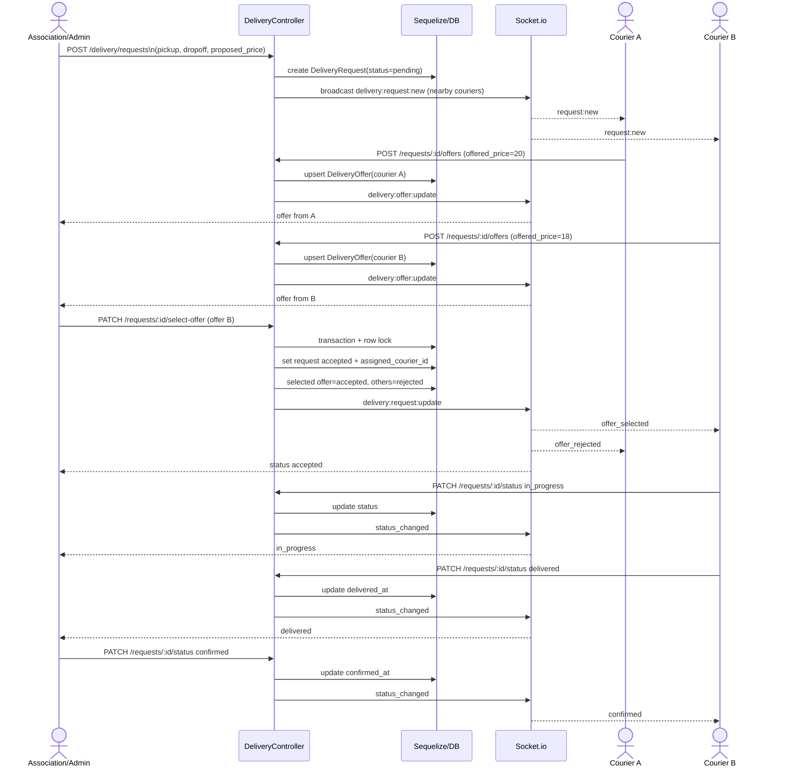
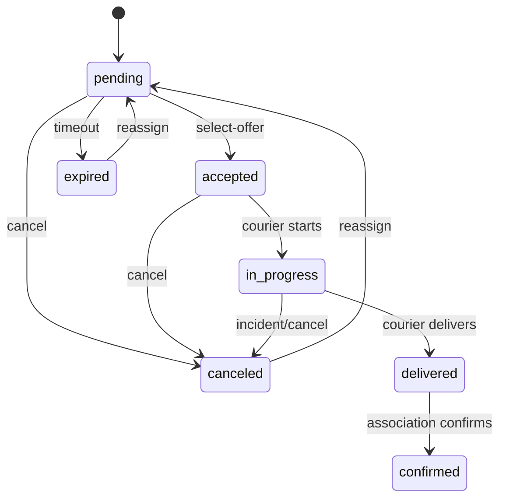

# UML - Projet Amena

## 1. Diagramme de composants (architecture globale)

## 2. Diagramme de classes (domaine principal)

## 3. Diagramme de sequence (livraison type inDrive)

## 4. Etats de livraison (state machine)

